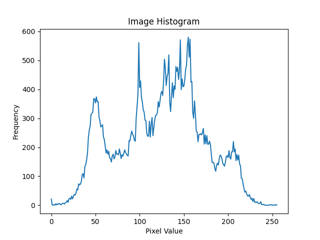

# gray-histogram

グレースケール画像のヒストグラム





## Installation

```bash
pip install poetry
poetry install
```

## Usage

コマンドライン引数で画像へのパスを指定してください

```bash
poetry run main.py images/lena.png
poetry run main.py path/to/image
```
